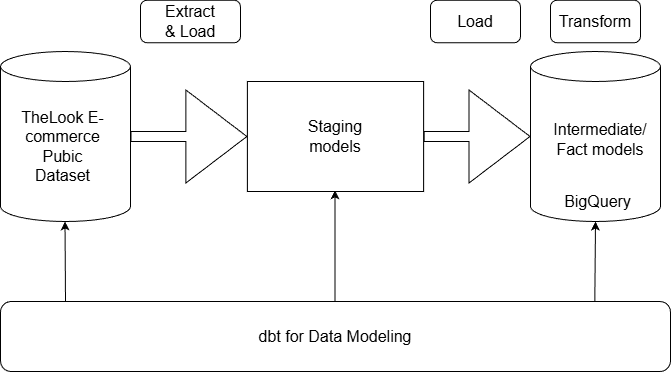

# 1. Project Overview

A dbt project built on TheLook E-commerce BigQuery public dataset designed to explore modern data modeling as well as extract, load and transform (ELT) workflows. This project covers the use of data models including staging, fact and intermediate models. Limitations for this project
includes small-scale pipeline (rowcount of over 100k), lack of incremental models and orchestration. 

Note: Airflow orchestration is carried out in another project repository at https://github.com/lowejie/looker-ecommerce-dbt-airflow-orchestration 

Below shows the high-level flowchart depicting the architecture of the project.

# 2. Tech Stack and Environment

- Programming Languages: Python v3.11, SQL, Jinja
- Data Modeling: dbt-core v1.11.2
- Cloud Warehouse: BigQuery
- IDE: Pycharm 2025.3.1
- Version Control: Git/GitHub
- OS: Windows 11
- Packages: dbt_utils

# 3. Data Sources and Schema

The tables used from TheLooker Ecommerce BigQuery Public Dataset includes:

- ### orders:
  - #### Columns:
      - order_id: Unique identifier for each order.
      - user_id: Identifier for each user who placed the order.
      - status: Status of the order.
      - gender: Gender of the user.
      - created_at: Timestamp indicating when the order was created.
      - returned_at: Timestamp indicating when the order was returned.
      - shipped_at: Timestamp indicating when the order was shipped.
      - delivered_at: Timestamp indicating when the order was delivered.
      - num_of_item: Number of items in the order.
  
- ### order_items:
  - #### Columns:
    - id: Unique identifier for each order item.
    - order_id: Identifier for associated order.
    - user_id: Identifier for the user who placed the order.
    - product_id: Identifier for the associated product.
    - inventory_item_id: Identifier for the associated inventory item.
    - status: Status of the order item.
    - created_at: Timestamp indicating when the order item was created.
    - shipped_at: Timestamp indicating when the order item was shipped.
    - delivered_at: Timestamp indicating when the order item was delivered.
    - returned_at: Timestamp indicating when the order item was returned.

Note: No preprocessing and cleaning assuming acceptable data quality for transformations.

orders table from TheLooker Ecommerce dataset in BigQuery

# 4. dbt Models and Transformations

Key Folder structure:
- models: Contains marts and staging subfolders which have intermediate and fact as well as staging models respectively. 
- macros: Contains reusable formulas for repeated transformations. 
- tests: Contains singular test SQL scripts.

Prefixes:
- stg_: Staging models
- int_: Intermediate models
- fct_: Fact models

Key transformations include aggregation by sum, joins and calculated metrics stored as macro.

Tests:
- Generic tests:
  - unique and not_null for orders.order_id column
  - not_null and relationship from order_items.order_id = orders.order_id
  - unique and not_null for fct_orders.order_key column
  - relationship from fct_orders.order_key = stg_thelook_orders.order_key
  - accepted_values for fct_orders.status_code column
- Singular tests:
  - negative total sales amount
  - valid order_date

# 5. Output and Results

Examples of output include:

Top 10 sales

Number of orders shipped

# 6. Running the project

- ### Prerequisites
  - Python with version compatible with dbt version used
  - dbt-core with BigQuery adapter installed (dbt-bigquery)
  - Google Cloud Platform access for project and service account creation as well as BigQuery
  - Service account credentials

- ### Setup
  1. Clone the repository \
  git clone https://github.com/lowejie/looker-ecommerce-bigquery-elt-pipeline.git \
  cd looker-ecommerce-bigquery-elt-pipeline
  
  2. Set up the Python environment in Windows \
  python -m venv venv \
  source venv/Scripts/activate \
  pip install dbt-core dbt-bigquery
  3. Configure dbt profile
     - Copy profiles.yml to ~/.dbt/profiles.yml and replace placeholders with own credentials
     - Ensure profile name matches with the one defined in dbt_project.yml
     - Configure authentication using service account key
  4. Run all models \
  dbt run \
  dbt test 
  
- ### Notes and Tips
  - Staging models are materialized as views while intermediate and fact models are tables in BigQuery
  - Ensure target dataset exists in BigQuery before running dbt.
  - If authentication errors occur, verify that service account key file path and active credentials.
  - dbt model dependencies and execution order are managed automatically via model references.
  
    
# 7. Challenges and Learnings

- ### Environment setup & configuration
Encountered obstacles configuring dbt with BigQuery in terms of profile and authentications. Resolved through multiple trial and errors of standardizing configs and validating reproducible runs, reinforcing importance of environmental consistency in data pipelines.
- ### dbt model structuring
Learned about structuring models into staging, intermediate and fact layers instead of embedding all within a single model, thereby improving modularity, reusability and maintainability.
- ### Jinja templating & macros
Gained hands-on experience with Jinja macros and references to centralize reusable formulas and code sections, practicing DRY principles in analytics engineering.
- ### Testing & data quality
Implemented dbt generic and singular tests including not_null, unique, relationships, accepted_values as well as customized test scripts to validate data quality and improve pipeline reliability.
- ### Workflow & maintainability
This project showcased how dbt enables version control, documentation and data tests which offers clear advantages over ad-hoc SQL in terms of maintainability and scalability.

# 8. Future Improvements

- Larger dataset required
- Implementation of incremental loads and models
- Streaming data ingestion
- PySpark integration for big data processing and complex analysis

# 9. References

Inspired by a Youtube tutorial video on ELT pipeline project using dbt, Snowflake and Airflow. Dataset and cloud warehouse differ from the original implementation. This project uses a BigQuery public dataset and Google BigQuery as the data warehouse.

Youtube tutorial video \
Code along - build an ELT Pipeline in 1 Hour (dbt, Snowflake, Airflow) by jayzern \
Link: https://www.youtube.com/watch?v=OLXkGB7krGo

dbt Fundamentals \
Learn dbt fundamentals \
Link: https://learn.getdbt.com/learn/course/dbt-fundamentals/welcome-to-dbt-fundamentals-5min/

Google Cloud Platform \
BigQuery Documentation \
Link: https://docs.cloud.google.com/bigquery/docs

